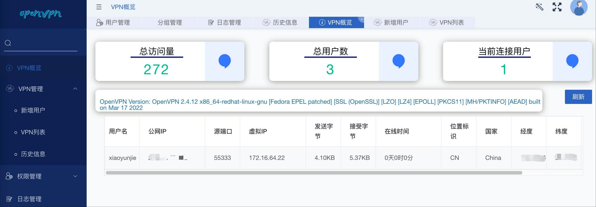
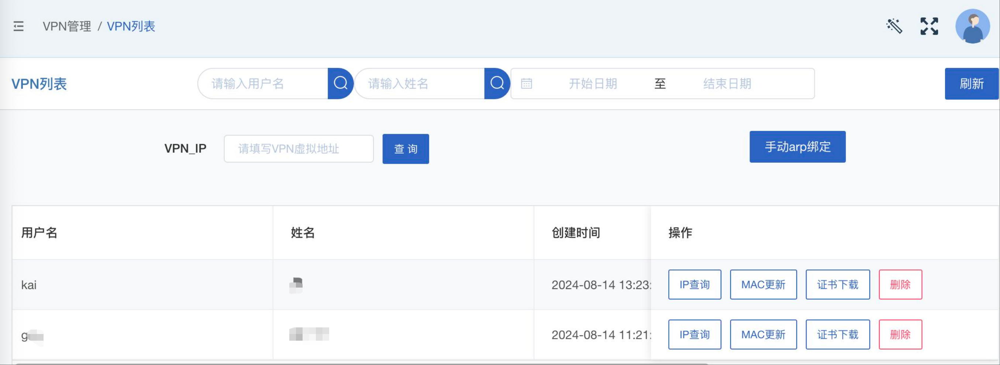
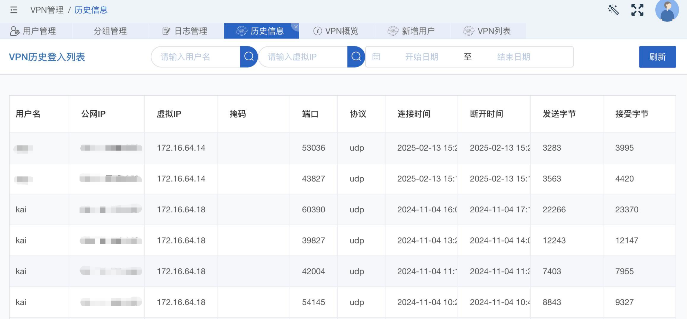

# openvpn-cms-flask  

### （如果此系统对你有所帮助，请Start一波！！）

## [前端系统传送门](https://github.com/xiaoyunjie/openvpn-cms-vue)

---
### 一、需求
使用`openvpn`开源系统构建了一整套满足vpn需求的产品。

需要一套针对openvpn的内容管理系统，操作简单、维护方便、交互体验好、有日志查询、权限管控、开放API等功能，同时提供插件扩展。

**功能：**
- web端交互，无需linux基础，操作简单
- 一键创建证书账户，操作交互友好
- 登入信息在线统计，IP、掩码、端口、协议、登入时间、流量使用统计等
- 历史登入信息查询
- 一键注销用户，方便省力
- 开放的API调用


---
### 二、语言环境选择
经过筛选，选择前后端分离，全部通过API交互，方便后续前后端系统的重构。

**前端选择：** `VUE`

**后端选择：** `FLASK`

**数据库：** `Mysql`

**语言环境：** `Python`


>基于开源框架Lin-cms二次开发

VPN概览


VPN列表


VPN历史信息



---
### 三、环境部署
##### CentOS 7
- python 3.6+
- mysql 5.6+
- openvpn 2.4.7+

##### 数据库
`curl -O http://repo.mysql.com/mysql-community-release-el7-5.noarch.rpm`

`rpm -ivh mysql-community-release-el7-5.noarch.rpm`

`yum install -y epel-release   mysql-community-server`

```sql
mysql -u root -p
create user 'root'@'localhost' identified by 'openvpn';
create database  openvpn default character set utf8mb4 collate utf8mb4_unicode_ci;
grant all on *.* to 'root'@'%';
create database openvpn;
flush privileges;
exit
```
建议修改mysql的字符集
```bash
[mysqld]
character_set_server=utf8mb4
```
**启动mysql**

`systemctl start mysqld`

**开机启动mysql**

`systemctl enable mysqld`


---
### 四、CMS部署

##### python36
`yum install -y gcc GeoIP GeoIP-devel python36  python36-setuptools  python36-devel`

`easy_install-3.6 pip`

##### openvpn-cms-flask
`git clone https://github.com/xiaoyunjie/openvpn-cms-flask.git  openvpn-cms-flask`

`cd openvpn-cms-flask && python3.6 -m venv venv`

```bash
## 指定pip源，加速下载
mkdir -p  /root/.pip/
cat >  /root/.pip/pip.conf   <<EOF
[global]
index-url = https://pypi.tuna.tsinghua.edu.cn/simple
[install]
trusted-host=pypi.tuna.tsinghua.edu.cn
EOF
```

##### 依赖安装

`source venv/bin/activate && pip3 install --upgrade pip && pip3 install -r requirements.txt`

##### 新增超级账户

`python add_super.py` （ super 123456）

##### 修改配置项
`vi openvpn-cms-flask/app/__init__.py` 修改地址和端口，地址为部署vpn的地址，端口使用11940

##### 启动服务
`python3.6 starter.py`

http://localhost:5000

----
###  五、openvpn部署
#### 配置文件
- 对于`server.conf`  `vars`等脚本，建议根据自己的需求来修改
```bash
setenforce 0
sed -i '/^SELINUX=/c\SELINUX=disabled' /etc/selinux/config
yum install -y epel-release openvpn  easy-rsa  expect zip
cp -r /usr/share/easy-rsa  /etc/openvpn/
cp -r /opt/openvpn-cms-flask/app/scripts/vars /etc/openvpn/easy-rsa/3.0/
cp /opt/openvpn-cms-flask/app/scripts/server.conf  /etc/openvpn/
cp /opt/openvpn-cms-flask/app/scripts/cmd/* /usr/local/bin/
cp /opt/openvpn-cms-flask/app/scripts/*.expect /etc/openvpn/easy-rsa/3.0/
```

##### 创建证书
```bash
cd /etc/openvpn/easy-rsa/3.0
./easyrsa init-pki
#创建ca，输入密码(两次),加上nopass则无需输入密码
./easyrsa build-ca  nopass
#生成 Diffie Hellman 参数
./easyrsa gen-dh
#创建服务端证书，重启openvpn服务也无需输入密码
./easyrsa build-server-full openvpnserver nopass
#创建ta.key
openvpn --genkey --secret ta.key
#证书注销验证
./easyrsa gen-crl
chmod 666 pki/crl.pem
## 开启内核转发功能
echo "net.ipv4.ip_forward = 1" > /etc/sysctl.conf
sysctl -p
#创建openvpn相关目录
mkdir -p  /var/log/openvpn
mkdir -p /opt/vpnuser
mkdir -p /etc/openvpn/easy-rsa/3/pki/Epoint
cp pki/ca.crt pki/Epoint/
cp ta.key pki/Epoint/
# client.ovpn 中的remote地址根据自己实际地址或域名来修改
cp /opt/openvpn-cms-flask/app/scripts/client.ovpn pki/Epoint/
#开启openvpn并设置开机启动
systemctl start openvpn@server
systemctl enable openvpn@server
# 每天凌晨重启，重新加载crl.pem，每10分钟执行一次ip mac绑定
crontab -l > /var/tmp/tmp.cron
echo "*/10 * * * *  sh  /usr/local/bin/add_arp.sh" >> /var/tmp/tmp.cron
echo "0 0 * * *  systemctl restart openvpn@server" >> /var/tmp/tmp.cron
crontab /var/tmp/tmp.cron
```

#### iptables配置
```bash
#停用firewalld，安装iptables
systemctl stop firewalld
systemctl disable firewalld
yum install iptables iptables-services
systemctl start iptables
systemctl enable iptables
# 开通系统和数据库端口
iptables -I INPUT 4 -p tcp -m state --state NEW -m tcp --dport 8000 -j ACCEPT
iptables -I INPUT 4 -p tcp -m state --state NEW -m tcp --dport 5000 -j ACCEPT
iptables -I INPUT 4 -p tcp -m state --state NEW -m tcp --dport 3306 -j ACCEPT
# 放通11940的tcp和udp端口
iptables -I INPUT 5 -p tcp -m state --state NEW -m tcp --dport 11940 -j ACCEPT
iptables -I INPUT 6 -p udp -m state --state NEW -m udp --dport 11940 -j ACCEPT
# 如果要在内网看到客户端的ip，则配置转发，否则配置nat，配置forward，需要在核心添加路由
iptables -I FORWARD 1 -m state --state RELATED,ESTABLISHED -j ACCEPT
iptables -I FORWARD 2 -s 172.16.64.0/20 -d 192.168.0.0/16 -j ACCEPT
# 配置nat转发
iptables -t nat -A POSTROUTING -o eth0 -j MASQUERADE
# 保存iptables配置
service iptables save
# 重新加载iptables配置文件
service iptables restart
```

openvpn密码是固定的：username@vpn ，username是新增的用户名

---

### 六、API接口
https://easydoc.xyz/doc/82789167/iBTVBVhE/CGQNK5YF

---

### 七、Feature
- 新增地图功能，将在线用户显示在地图上
- 新增在线踢出用户下线功能

## 如果此系统对你有所帮助，请Start一波！！

## 欢迎交流

QQ：2913381648
